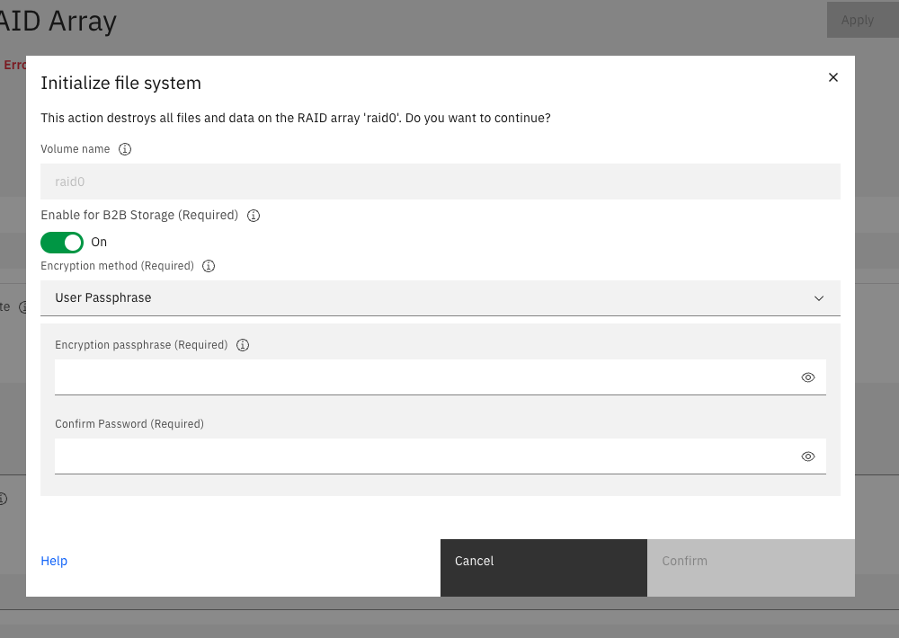
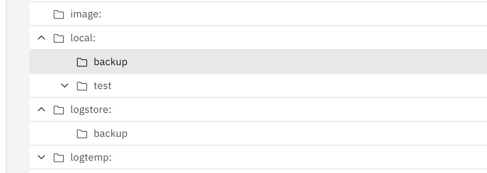

# RAID Setup Guide for DataPower on Linux

## Overview

The RAID device is needed for B2B and can be used for quota enforcement and other features. When the platform is Linux®, the `DataPowerRaidDevice` directive in the `datapower.conf` file controls how the DataPower® Gateway emulates the RAID device.

## DataPowerRaidDevice Options

The `DataPowerRaidDevice` directive has three options:

- **`DataPowerRaidDevice=`** (none) - No RAID device is defined
- **`DataPowerRaidDevice=device`** - A secondary block device on the host system backs the DataPower RAID (e.g., `/dev/sdd`)
- **`DataPowerRaidDevice=file`** - A user-defined image file backs the DataPower RAID (e.g., `/opt/ibm/datapower/raid.img`)

> **Note:** The minimal storage capacity of the image file is 800 MB. The Linux administrator must create and manage the image file in the Linux host. When correctly defined, the DataPower Gateway uses this file with a Linux loop device.

## Prerequisites

- DataPower Gateway must be installed and running
- Root or sudo access to the Linux host
- Sufficient disk space for the RAID image file (minimum 800 MB, recommended 12 GB or more)

## Setup Procedure

### Step 1: Stop the DataPower Service

Stop the DataPower service before making configuration changes. Run with `sudo` if you are non-root.

```bash
systemctl stop datapower
```

Verify the service is stopped:

```bash
systemctl status datapower
```

### Step 2: Create the RAID Image File

Create an image file on the Linux host using the `dd` command. The following example creates a 12 GB image file at `/opt/ibm/datapower/raid.img`:

```bash
dd if=/dev/zero of=/opt/ibm/datapower/raid.img bs=1M count=12000
```

> **Note:** This command may take several minutes to complete depending on the size and disk speed.

### Step 3: Configure datapower.conf

Open the `datapower.conf` file for editing. Run with `sudo` if you are non-root.

```bash
sudo vi /opt/ibm/datapower/datapower.conf
```

Add or modify the `DataPowerRaidDevice` directive to point to your RAID image file:

```
DataPowerRaidDevice=/opt/ibm/datapower/raid.img
```

Save your changes and exit the editor.

**Example datapower.conf with RAID configuration:**

```
DataPowerConfigDir=/datapower/config
DataPowerLocalDir=/datapower/local
DataPowerAcceptLicense=true
DataPowerRaidDevice=/opt/ibm/datapower/raid.img
```

### Step 4: Restart the DataPower Service

Restart the DataPower service to apply the configuration changes. Run with `sudo` if you are non-root.

```bash
systemctl start datapower
```

Check the status to ensure the service started successfully:

```bash
systemctl status datapower
```

Wait approximately 5 minutes for the service to fully start.

### Step 5: Configure the RAID Array (GUI)

Access the DataPower Web Management Interface to configure the RAID array:

1. Open a web browser and navigate to: `https://<server-hostname>:9090`

2. Log in with your DataPower credentials (default: `admin`/`admin`)

3. Navigate to the RAID array configuration section

4. Enable the RAID array and configure it according to your requirements

> **Note:** You may receive a message about "unable to make storage volume accessible" when the RAID array is configured but its file system is not initialized. This is expected and will be resolved in the next step.




*Screenshot showing the intialization of the RAID directory*

### Step 6: Initialize the RAID File System

After configuring the RAID array in the GUI, you need to initialize the file system to make it active:

1. In the DataPower Web Management Interface, navigate to the RAID file system initialization section

2. Follow the prompts to initialize the RAID file system

3. Once initialized, the RAID array will be active and ready for use


